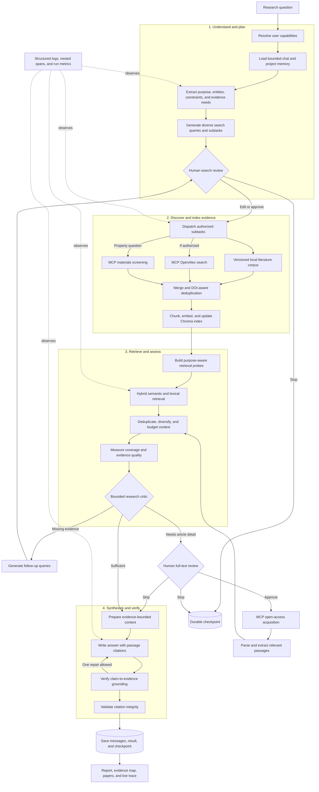
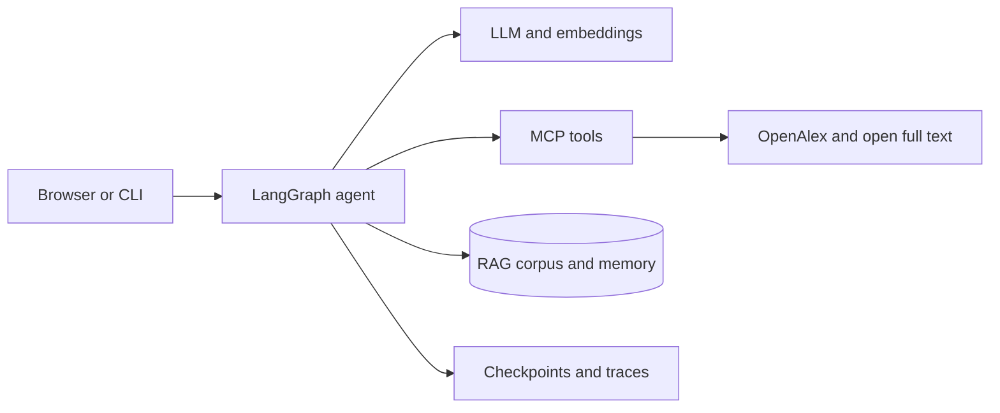
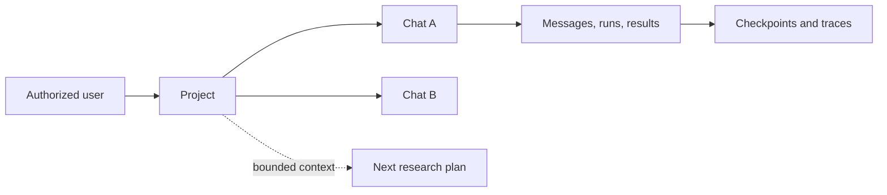
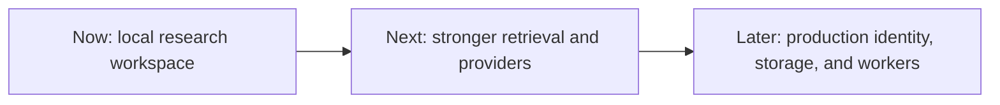

# Scientific Literature Research Agent

A working Python research-agent MVP for materials-science literature questions. It retrieves from a durable local corpus, optionally expands discovery through OpenAlex, ranks evidence passages, deep-reads authorized open-access articles, and produces an answer with validated citations.

This repository is intentionally small and inspectable. It includes a CLI, Python library, and local browser workbench; it is not a hosted multi-user service.

## Current Status

Implemented and tested:

- LangGraph workflow orchestration with conditional research loops
- Bounded critic reflection with typed retry, deep-read, sufficient, and stop decisions
- Explicit research goals, progress, and typed subtasks
- Bounded concurrent search and full-text work
- Exclusive MCP boundary for literature search and full-text acquisition
- OpenAlex metadata and abstract search
- DOI-aware paper deduplication
- Passage-level hybrid retrieval with Chroma or an in-memory fallback
- Versioned local literature corpus and persistent embedded Chroma index
- Simulated user-level tokens for RAG, MCP tool, full-text, and materials-database authorization
- Optional OpenAI embeddings and answer synthesis
- Deterministic local operation without an OpenAI key
- Selective open-access PDF, JATS/XML, and HTML reading
- Evidence-context budgeting, deduplication, diversity, and prompt-injection boundaries
- Inline citation validation
- Claim-to-evidence verification with one bounded repair pass
- Browser workbench for reports, evidence maps, papers, and execution traces
- Seeded local experiment demo with explicit synthetic-data provenance
- Scientific ML candidate screening over 4,604 measured Matbench band gaps
- Agent-callable material screening through MCP with RAG-ready `[M#]` records
- Local composition-neighbor property estimates with uncertainty and model provenance
- Structured JSON logs with run, trace, span, node, tool, and subtask correlation
- Local persisted tracing and an integrated inspector for graph, LLM, MCP, and retrieval operations
- End-of-run latency, usage, research-volume, retry, error, and goal-status metrics
- Human approval before searches and full-text acquisition
- Durable project memory with multiple reopenable chats and saved structured results
- Bounded chat/project continuity context for intent and query planning
- Server-enforced hierarchical access control for projects, chats, runs, and checkpoints
- Offline evaluation with distractors, retrieval metrics, grounding checks, and quality gates
- 75 automated tests

Not implemented:

- Paywall bypassing or institutional-login automation
- OCR for scanned PDFs
- GROBID or a comparable production scholarly-document parser
- User accounts or hosted multi-user deployment
- Production monitoring, distributed queues, or multi-machine workers
- A complete systematic-review protocol
- Guaranteed factual correctness; model-based entailment remains probabilistic

## Visual Overview

GitHub renders these Mermaid diagrams directly. The workflow comes first because it
is the fastest way to understand how a question becomes a grounded answer.

### Research workflow



Search and reading subtasks can execute concurrently, while the critic keeps retries
bounded. Memory informs intent but never becomes evidence; only retrieved passages
enter the synthesis context. Human stops and interruptions are durable checkpoints.

### System architecture



### Memory and access model



Clearance is hierarchical: Principal Investigator, Researcher, then Local Reader.
Memory helps plan later searches but is never treated as citable evidence.

## Quick Start

Python 3.11 or newer is required.

```bash
python3 -m venv .venv
source .venv/bin/activate
pip install -e ".[dev]"
cp .env.example .env
python -m app.main "How are graph neural networks used for crystal property prediction?"
```

The first live run requires network access to OpenAlex. An OpenAI key is optional.

## Browser Workbench

Start the local UI:

```bash
scientific-literature-ui --port 8000
```

Then open `http://127.0.0.1:8000`. The workbench runs the same graph as the CLI and visualizes:

- goal progress and workflow stages;
- the grounded report with clickable evidence labels;
- a citation-to-passage evidence map;
- ranked papers and source metadata;
- search and deep-reading subtasks;
- grounding verdict and repair counts.
- a reproducible synthetic model benchmark, clearly separated from published evidence.
- a Scientific ML workspace for property-constrained material candidate screening.

The browser supports human-review pause, edit, approve, skip, stop, and resume controls.
The local experiment demo uses generated values only. It does not claim to reproduce a published benchmark or laboratory measurement.

## Scientific ML Candidate Screening

The **Scientific ML** tab is an independent material-property tool. It screens
the local `matbench_expt_gap` database by experimental band-gap range, required
elements, excluded elements, and result count. Results are ranked toward the
center of the requested property window and returned with selection reasons and
source provenance.

The bundled database contains 4,604 composition-level experimental band-gap
records from Matbench. The tool generates compact `[M#]` material records that
can be inserted into a later synthesis context alongside literature `[P#]`
evidence. Material records explicitly say that they are database measurements,
not claims extracted from papers.

### Current property model

The current model is `composition-knn-matbench-expt-gap-v1`, a local,
dependency-free **k-nearest-neighbor regression baseline** for experimental band
gap. It uses the 4,604 Matbench records directly as its reference set. It is a
real predictive model, but it is not a neural network and it has no separately
optimized weights or checkpoint: kNN is a nonparametric, instance-based method.

For an input formula such as `TiO2`, prediction works as follows:

1. Parse the flat chemical formula into element counts: `Ti: 1`, `O: 2`.
2. Normalize counts into atomic fractions: `Ti: 1/3`, `O: 2/3`.
3. Represent every valid reference composition in the same sparse
   element-fraction space.
4. Compute L1 composition distance over the union of elements:
   `distance(a, b) = sum(|a_element - b_element|)`.
5. Select the seven nearest reference compositions.
6. Weight each neighbor by `1 / max(distance, 0.02)` and return the weighted
   average of its measured band gaps.
7. Report uncertainty as the square root of the weighted variance among those
   seven neighbor measurements.

The prediction response contains:

- `predicted_band_gap_ev`: the model estimate;
- `uncertainty_ev`: local neighbor disagreement, not a calibrated confidence interval;
- `neighbor_formulas`: the seven records supporting the estimate;
- `model_name`: the exact model implementation used.

The model is exposed through `POST /api/materials/predict` and behind the
`MaterialPropertyPredictor` interface, allowing a pretrained model to replace
it without changing the screening service. The measured-candidate table does
not invoke this model: it filters real database measurements. Predictions and
measurements remain deliberately separate in API responses and RAG context.

### Model limitations

This baseline sees only elemental fractions. It does not see crystal structure,
space group, bonding geometry, pressure, temperature, polymorph identity, or
synthesis conditions. Different structures with the same composition are
therefore indistinguishable. Its uncertainty measures neighbor disagreement
only and can be overconfident outside the reference distribution.

Use it for rapid hypothesis ranking and demonstration, not as evidence of phase
stability, synthesizability, toxicity, or experimental validation. A stronger
next adapter should use a structure-aware pretrained model such as CHGNet or
MatGL and should be evaluated on held-out, leakage-controlled material splits.

Data source and citation details are recorded in `data/materials/README.md`.

## Operating Modes

### Local fallback mode

With no `OPENAI_API_KEY`, the system uses:

- deterministic query templates;
- deterministic local hash embeddings;
- an extractive answer writer;
- OpenAlex for live literature search;
- Chroma when installed, otherwise an in-memory vector store.

This mode is useful for development and tests. The local hash embedding is deliberately lightweight and is not expected to match a production embedding model.

```bash
python -m app.main "How are GNNs used for crystal property prediction?"
```

### OpenAI-backed mode

Set the following in `.env` or the process environment:

```dotenv
OPENAI_API_KEY=...
OPENAI_MODEL=gpt-4o-mini
OPENAI_EMBEDDING_MODEL=text-embedding-3-small
EMBEDDING_PROVIDER=openai
```

When configured, OpenAI is used for search-query generation, embeddings, and answer synthesis. If an OpenAI call fails, the application falls back to deterministic local behavior.

### Qwen-backed mode

Qwen uses Alibaba Cloud Model Studio's OpenAI-compatible API for query planning, synthesis, critic reflection, and semantic grounding:

```dotenv
LLM_PROVIDER=qwen
QWEN_API_KEY=...
QWEN_MODEL=qwen3.8-27b
QWEN_BASE_URL=https://dashscope.aliyuncs.com/compatible-mode/v1
LLM_FEATURES=planning,critic,synthesis,grounding
LLM_TIMEOUT_SECONDS=60
```

Use `https://dashscope-intl.aliyuncs.com/compatible-mode/v1` for international-region keys. Model Studio keys are region-bound. The quality-first default uses Qwen for planning, critic reflection, synthesis, and semantic grounding. Embeddings remain local until a dedicated embedding model is configured. Provider failures fall back to deterministic local behavior; latency optimizations must not silently disable configured reasoning stages.

### Async mode

Use LangGraph's asynchronous invocation API:

```bash
python -m app.main --async-work \
  "How are GNNs used for crystal property prediction?"
```

Python callers can use:

```python
from app.main import arun

state = await arun("How are GNNs used for crystal property prediction?")
```

Search and deep-reading subtasks run concurrently inside a bounded worker pool. Async mode makes orchestration non-blocking to a Python caller; it is not a persistent background-job queue.

### Human-review mode

```bash
python -m app.main --interactive \
  "What methods are used for crystal property prediction?"
```

The graph pauses before every external search batch, including generated follow-up searches. A reviewer may:

- approve the proposed queries;
- replace the queries;
- add an instruction that immediately creates a focused retrieval probe;
- stop before search execution.

For detailed questions, the graph pauses again before full-text acquisition. A reviewer may:

- approve all proposed papers;
- select specific paper IDs;
- add an instruction for evidence interpretation and synthesis;
- skip full-text reading and use abstracts;
- stop the workflow.

Review decisions are stored in `human_review_history`, and active guidance is stored in `reviewer_instructions`. Interactive graphs use LangGraph's SQLite checkpointer by default, so every pause survives process restarts. The default database is `.cache/checkpoints/research.sqlite`; override it with `CHECKPOINT_DB_PATH`.

Give a run a stable thread ID, then resume the same checkpoint later:

```bash
python -m app.main --interactive --thread-id crystal-review-01 \
  "What methods are used for crystal property prediction?"

python -m app.main --resume-thread-id crystal-review-01
```

The checkpoint is committed before the review prompt appears. Ending the terminal at that prompt does not lose completed planning or search work, and resumption does not rerun completed graph nodes.

The browser workbench uses the same checkpointed workflow. Submitting a question opens a review dialog before search and, when requested, before full-text acquisition. The dialog supports query editing, paper selection, new reviewer guidance, skipping full text, approval, and immediate stop. A separate Stop control remains available while planning, searching, retrieving, deep reading, synthesizing, or verifying. It releases the browser immediately and signals cooperative backend cancellation; a provider request already in flight may run until its configured timeout, but no later graph operation will begin. Refreshing the page does not delete the SQLite checkpoint, and reopening a paused chat restores its pending review.

### Project and chat memory

The browser stores a user-facing workspace hierarchy in
`.cache/memory/workspaces.sqlite`:

- a project is a durable research workspace;
- each project can contain multiple independent chats;
- each chat stores ordered user questions and assistant responses;
- assistant messages retain the complete structured result, so reopening restores
  the report, evidence, papers, and trace without rerunning research;
- paused chats retain their checkpoint thread and reopen the pending HITL review.

Before a new run, the agent builds a bounded continuity packet from recent messages
in the current chat and sibling chats in the same project. This context is used only
for intent interpretation and search-query planning. It is explicitly treated as
untrusted memory, never as scientific evidence or a citation source. Configure the
database with `MEMORY_DB_PATH`.

### Simulated authorization

The browser includes an authorization dropdown for demonstrating capability-based
access. These are fixed local simulation tokens, not production authentication:

- **Local Reader**: embedded literature RAG only;
- **Researcher**: local RAG, OpenAlex/MCP search, and the materials database;
- **Principal Investigator**: Researcher capabilities plus full-text acquisition.

The browser sends a token ID, and the server resolves the capability set. It does
not trust a browser-provided role. The token ID and resolved non-secret profile are
preserved in checkpoint state so resumed work keeps the same permissions. MCP tools
validate the propagated token again at the server boundary. Replace this simulation
with signed identity tokens and a real policy service before any multi-user deployment.

Projects are stamped with the creating tier and chats inherit their project's minimum
access level. Clearance is hierarchical: Principal Investigator can access Researcher
and Local Reader workspaces, Researcher can access Local Reader workspaces, and Local
Reader cannot access higher-tier projects or chats. The API enforces this policy for
listing, opening, creating chats, starting runs, restoring checkpoints, resuming,
cancelling, and reading live traces. UI filtering is only a convenience and is not
the authorization boundary. Historical thread-to-chat mappings preserve the boundary
after a run completes.

## Workflow

The top-level diagram shows the complete research loop. Internally, the graph keeps
planning, search, indexing, retrieval, critique, deep reading, synthesis, grounding,
and validation as separate observable nodes.

With human review enabled, `review_search_plan` is inserted before every `search_papers` batch and `review_deep_read` is inserted before `deep_read_papers`.

`critique_research` is a bounded decision node rather than an unconstrained second agent. It records missing topics, weak evidence, recommended queries, confidence, and remaining retry budget in `critique_history`. The default critic is deterministic and local; `ResearchCritic` is the provider interface for adding an LLM-backed critic later without changing graph routing.

## Intent-First Planning And RAG

Planning is a two-stage structured operation. Before generating keywords, the planner records:

- the research purpose, such as methods, comparison, quantitative evidence, datasets, or limitations;
- a precise objective;
- scientific entities, properties, and methods;
- required evidence types and explicit constraints;
- unresolved ambiguities that must not be silently guessed.

It then creates three to five non-redundant search queries. Each query has an evidence angle and rationale. The graph preserves this as `research_intent` and `query_rationales` for review and debugging.

RAG does not retrieve against the raw question alone. It builds complementary probes from the original question, identified entities, purpose terminology, and evidence requirements. Rankings are fused while retaining the original question as the anchor. The indexed corpus always includes the checked-in records in `data/literature/seed_corpus.json` for authorized users, then merges papers discovered during the current OpenAlex search. This means RAG remains active in local-only mode and is no longer dependent on live internet results. Context selection adds purpose alignment, source diversity, duplicate removal, full-text provenance, and token budgeting.

## Goals And Subtasks

Every run creates a `ResearchGoal` with:

- the user question as its objective;
- minimum relevant-paper, passage, and concept-coverage criteria;
- citation-validated answer completion as a final criterion;
- progress from `0.0` to `1.0`;
- one of these statuses:
  - `planned`
  - `running`
  - `evidence_ready`
  - `completed`
  - `budget_exhausted`
  - `cancelled`

Search and deep-reading work is represented by `ResearchSubtask`. Each subtask records:

- stable ID and kind;
- objective and iteration;
- query or paper ID;
- `pending`, `running`, `completed`, `failed`, or `skipped` status;
- result count and result IDs;
- any error.

The default maximum concurrency is four tasks. It can be changed when constructing the graph:

```python
from app.graph import build_research_graph

graph = build_research_graph(max_concurrent_tasks=2)
```

## Observability And Tracing

The agent exposes three complementary forms of telemetry:

- **Logs** are local structured events for individual starts, completions,
  failures, routing decisions, provider results, and durations. They are the
  fastest way to debug one failed MCP or model call.
- **Traces** connect nested operations into one local execution tree. Explicit
  spans cover graph nodes, routing, LLM calls, MCP calls, retrieval, context
  preparation, and concurrent subtasks.
- **Metrics** are a concise per-run summary returned in `state["run_metrics"]`
  and printed by the CLI.

Every run receives a `run_id` and `trace_id`. Local spans receive unique
`span_id` values and retain their `parent_span_id`. The correlation context is
copied into concurrent search and deep-reading workers. MCP requests also carry
run, trace, and parent-span identifiers to the server when the tool schema
supports them.

### Local structured logs

JSON logging is enabled by default:

```dotenv
OBSERVABILITY_JSON_LOGS=true
OBSERVABILITY_LOG_LEVEL=INFO
OBSERVABILITY_CAPTURE_CONTENT=false
```

A typical event includes `timestamp`, `severity`, `event`, `run_id`,
`trace_id`, `span_id`, operation name, duration, and status. Depending on the
operation, it may also include the LangGraph node, route decision, MCP tool,
subtask ID, result count, provider status, retrieval IDs, or scores.

To debug a failed MCP call, filter logs by the research `run_id`, then inspect
`mcp.client.<tool>`, `mcp.server.<tool>`, `mcp.provider_result`, and
`mcp.provider_failed`. Client failures identify transport/tool errors; server
events identify provider failures and result counts.

To understand graph routing, inspect `routing.decision` events. They record the
router name and selected branch, such as `generate_followup_queries`,
`deep_read_papers`, or `write_answer`. Search iteration and critic history remain
available in graph state for the scientific reason behind that decision.

### Local trace storage and UI

Local tracing requires no account, API key, hosted service, or usage payment.
It is enabled by default:

```dotenv
LOCAL_TRACE_ENABLED=true
LOCAL_TRACE_DIR=.cache/traces
```

Each execution is streamed into the browser's **Trace** tab while research is
still running. The workbench polls incremental redacted events and shows active
and completed graph nodes, retrieval, tool, and model operations without waiting
for the final answer. Live events are available through
`GET /api/research/sessions/{thread_id}/trace?after={event_count}`.

Completed executions are stored atomically as redacted JSON documents named by
`trace_id`. Inspect correlation IDs, summary metrics, routing decisions, nested
subtasks, failures, and latency in the same **Trace** tab or through
`GET /api/traces?limit=25` and `GET /api/traces/{trace_id}`. Storage and live
display failures never fail the research workflow. Human-review interruptions
are recorded as interruptions, not errors, and resumed work keeps the same run
context.

### RAG and LLM telemetry

Retrieval telemetry records the embedding function, hashed query identifier,
probe count, top-K, selected passage IDs, retrieval scores, duration, context
selection counts, context budget usage, and duplicate/budget removals.

LLM telemetry records provider/model metadata, operation name, duration, call
count, token usage when returned by the provider, validation/fallback events,
and retry count when observable. Estimated cost remains `null` unless reliable
pricing metadata is available; the agent does not invent cost estimates.

### Run summary

`run_metrics` contains total duration, LLM and tool calls, search iterations,
papers discovered and selected, evidence passages, deep-reading operations,
input/output tokens, estimated cost when available, retries, errors, final goal
status, retrieval diagnostics, and context-budget statistics.

### Privacy and retention

API keys, authorization headers, credentials, passwords, secrets, and token-like
fields are recursively redacted. Raw prompts, responses, research questions,
and full evidence text are not included in explicit telemetry by default.
`OBSERVABILITY_CAPTURE_CONTENT=false` documents and preserves this default; do
not enable content capture for sensitive research without reviewing provider
retention and access policies. Local log retention is controlled by the process
supervisor or shell redirection. Local trace retention is controlled by files
under `LOCAL_TRACE_DIR`; no automatic upload or external retention occurs.
Delete or archive that directory according to the project's retention policy.

## Literature Search

`OpenAlexSearchClient` sends query text to the OpenAlex works API and requests:

- OpenAlex work ID;
- title;
- reconstructed abstract;
- authors;
- publication year;
- DOI;
- venue;
- citation count;
- landing-page URL.

Results from multiple queries are combined and deduplicated. DOI is preferred as the deduplication key, followed by provider ID.

The default research thresholds are:

```text
max_search_iterations = 3
min_relevant_papers = 4
min_evidence_passages = 4
min_concept_coverage = 0.60
```

These are configurable through `build_research_graph()`.

The application accesses external literature only through the stdio MCP server. It has no direct OpenAlex or full-text provider fallback. Tool failures are retained in graph state so boundary failures remain visible rather than silently switching execution paths.

## MCP Tools

Start the server directly with:

```bash
python -m mcp_server.server
```

The server exposes three tools. Interpretation remains inside the LangGraph workflow.

### `search_papers`

```text
search_papers(query: str, limit: int = 10)
```

Returns serialized `Paper` records from OpenAlex.

### `get_full_text`

```text
get_full_text(
    paper_id: str,
    doi: str | None = None,
    url: str | None = None,
)
```

Behavior:

- retrieves full OpenAlex location metadata;
- proceeds only when OpenAlex marks the work open access;
- considers open-access PDF and landing-page URLs;
- accepts HTTPS public targets only;
- rejects local, loopback, link-local, and private literal IP addresses;
- validates every redirect before following it;
- limits downloads to 25 MB;
- caches extracted documents under `.cache/fulltext`;
- returns `None` when no usable legal copy can be acquired.

After acquisition, the graph-owned `PaperEvidenceExtractor` ranks question-relevant passages and groups evidence into:

- methods;
- datasets;
- results;
- limitations;
- conclusions.

Every evidence claim retains section, page when available, and source URL. This separation keeps MCP responsible for external data access and LangGraph responsible for research reasoning.

### `screen_material_candidates`

```text
screen_material_candidates(
    min_band_gap_ev: float = 1.0,
    max_band_gap_ev: float = 2.5,
    include_elements: list[str] | None = None,
    exclude_elements: list[str] | None = None,
    top_k: int = 20,
)
```

Returns ranked measured candidates, transparent reasons, dataset provenance,
and a RAG-ready material context. This tool is local and does not require
network access or an LLM key.

## Selective Full-Text Reading

Full text is not downloaded for every search result. A keyword heuristic activates deep reading for questions that request details such as:

- architecture or methods;
- datasets or experimental setup;
- exact or quantitative results;
- performance comparisons;
- mechanisms;
- limitations or reproducibility.

Only the top-ranked papers are considered, with a default maximum of three. PDF text is extracted with `pypdf`; JATS/XML and article HTML use local structured parsers.

Important limitations:

- PDF extraction preserves page numbers but does not reliably infer semantic section headings.
- HTML extraction is intentionally simple and may include navigation or omit dynamically rendered content.
- Scanned PDFs are not OCRed.
- Publisher layouts vary, so some open-access pages will fail extraction.
- Full-text availability and licenses depend on OpenAlex metadata and the source site.

If deep reading fails, abstract evidence remains available and the limitation is recorded in state.

## RAG And Retrieval

Abstracts are split into sentence-aware passages, usually no longer than 700 characters. Full-text sections are split into passages of up to approximately 900 characters.

The retrieval score is:

```text
0.7 * semantic similarity + 0.3 * normalized keyword overlap
```

With Chroma, the system retrieves up to `top_k * 3` semantic candidates and hybrid-reranks them. The in-memory store applies the same hybrid formula directly.

Embedding selection:

- `EMBEDDING_PROVIDER=openai` plus `OPENAI_API_KEY`: OpenAI embeddings;
- otherwise: deterministic 128-dimensional hash embeddings.

When Chroma is installed, its embedded index persists at `.cache/chroma` by
default. Override it with `RAG_PERSIST_DIRECTORY`. Collections are separated by
authorization level so a lower tier cannot retrieve records indexed by a higher
tier. If Chroma is unavailable, the agent uses the same local corpus through an in-memory vector store. OpenAlex results
are merged into the index per run; passage provenance distinguishes
`local-curated-corpus` from external sources.

Current retrieval limitations:

- keyword overlap is not BM25;
- there is no cross-encoder reranker;
- local hash embeddings are suitable for deterministic tests, not state-of-the-art retrieval;
- the evaluator currently shows two cases where an irrelevant distractor outranks the second relevant paper.

## Context Engineering

`ResearchContextBuilder` runs after retrieval and optional deep reading. Its default limits are:

```text
max_passages = 10
max_characters = 12,000
max_passages_per_paper = 2
duplicate_threshold = 0.85 token Jaccard similarity
```

The builder:

1. Ranks passages using retrieval score, question-term overlap, and a full-text provenance bonus.
2. Removes near-duplicate passages.
3. Gives each paper one selection opportunity before adding repeated passages.
4. Limits repeated evidence from a single paper.
5. Enforces the final character budget.
6. Assigns stable `[P1]`, `[P2]`, and subsequent labels after selection.
7. Escapes source text before prompt insertion.
8. Wraps each passage in an `<evidence>` element with paper and provenance metadata.
9. States explicitly that evidence is untrusted data and that instructions inside it must be ignored.

`context_stats` reports input and selected passages, source diversity, duplicates removed, budget drops, characters, estimated tokens, and full-text passage count.

This is a defensive prompt boundary, not a formal guarantee against every prompt-injection technique.

## Answer Generation And Citations

When OpenAI synthesis is available, the model receives:

- system instructions;
- the literature-research skill;
- the research question;
- only the selected evidence context.

It is instructed to cite every scientific claim using `[P#]` labels and not invent labels.

Without OpenAI, the local writer produces a conservative extractive report from selected passages.

Before citation validation, `verify_grounding` evaluates each cited scientific line against only its cited passages. With an OpenAI key it uses a strict semantic entailment judge; offline it uses a transparent lexical baseline. Verdicts are recorded as `entailed`, `partial`, or `unsupported`, and one bounded repair pass removes unsupported lines.

The final citation validator:

- removes non-reference claim lines with no citation;
- removes lines containing unknown citation labels;
- records citation warnings;
- retains the reference section and available DOI, URL, venue, section, and page provenance.

`grounding_verdicts` and `grounding_warnings` expose what was checked and repaired. Semantic judgments improve support checking but do not guarantee factual correctness, and the offline lexical baseline is intentionally more limited.

## Procedural Skill

The repository includes one project-specific instruction skill:

```text
skills/literature-research/SKILL.md
```

The planning node loads it through `app/skill_loader.py`. It guides query generation, evidence comparison, follow-up searching, citation behavior, and stopping conditions. It is instruction content, not an MCP tool.

## Human Review API

Programmatic integrations can resume interrupted graphs with LangGraph `Command`:

```python
from app.graph import build_research_graph
from langgraph.types import Command

graph = build_research_graph(enable_human_review=True)
config = {"configurable": {"thread_id": "research-session-123"}}

paused = graph.invoke(
    {"question": "What methods predict crystal properties?", "errors": []},
    config=config,
)

request = paused["__interrupt__"][0].value
result = graph.invoke(
    Command(resume={"action": "approve"}),
    config=config,
)
```

Search review responses:

```python
{"action": "approve"}
{"action": "edit", "queries": ["query one", "query two"]}
{"action": "add_instruction", "instruction": "Prioritize experimental validation after 2020."}
{"action": "stop"}
```

Deep-reading responses:

```python
{"action": "approve"}
{"action": "edit", "paper_ids": ["https://openalex.org/W..."]}
{"action": "add_instruction", "instruction": "Separate measured results from simulations."}
{"action": "skip"}
{"action": "stop"}
```

`cancel` remains accepted as a backward-compatible alias for `stop`. Reviewer instructions are bounded, checkpointed, displayed in later review requests, and included in the final synthesis context under `REVIEWER GUIDANCE`.

## Important State Fields

The compiled graph returns a `ResearchState` dictionary. Useful fields include:

| Field | Meaning |
| --- | --- |
| `goal` | Objective, success criteria, progress, and lifecycle status |
| `subtasks` | Search and deep-reading work with status and results |
| `search_queries` | Most recent approved query batch |
| `searched_queries` | All executed queries |
| `papers` | Deduplicated papers accumulated across iterations |
| `retrieved_passages` | Final context-selected evidence in citation-label order |
| `retrieved_papers` | Papers represented in retrieval before context filtering |
| `evidence_coverage` | Fraction of extracted question concepts found in evidence |
| `missing_concepts` | Question concepts not found in retrieved evidence |
| `evidence_notes` | Reasons evidence did not meet configured thresholds |
| `fulltext_documents` | Successfully acquired structured full-text documents |
| `paper_readings` | Structured focused-reading results |
| `synthesis_context` | Final escaped context sent to synthesis |
| `context_stats` | Context size, diversity, and filtering diagnostics |
| `citation_warnings` | Claims removed for missing or invalid labels |
| `human_review_history` | Approved, edited, skipped, or cancelled review decisions |
| `reviewer_instructions` | Durable human guidance applied to retrieval and synthesis |
| `checkpoint_thread_id` | Stable ID used to resume an interactive run |
| `memory_context` | Bounded current-chat and project continuity supplied to planning |
| `memory_stats` | Counts and size of the continuity context |
| `errors` | Recoverable provider or subtask errors |

## Configuration

Environment variables:

| Variable | Required | Default | Purpose |
| --- | --- | --- | --- |
| `OPENAI_API_KEY` | No | unset | Enables OpenAI planning and synthesis; required for OpenAI embeddings |
| `OPENAI_MODEL` | No | `gpt-4o-mini` | Chat model used for planning and synthesis |
| `OPENAI_EMBEDDING_MODEL` | No | `text-embedding-3-small` | OpenAI embedding model |
| `LLM_PROVIDER` | No | `openai` | Chat provider: `openai` or `qwen` |
| `QWEN_API_KEY` | For Qwen | unset | Alibaba Cloud Model Studio key; keep only in `.env` |
| `QWEN_MODEL` | No | `qwen3.8-27b` | Qwen model used for planning, synthesis, criticism, and grounding |
| `QWEN_BASE_URL` | No | international endpoint | Region-specific OpenAI-compatible Model Studio endpoint |
| `EMBEDDING_PROVIDER` | No | `local` | Set to `openai` to request OpenAI embeddings |
| `OPENALEX_MAILTO` | No | unset | Identifies the caller to OpenAlex |
| `FULLTEXT_CACHE_DIR` | No | `.cache/fulltext` | Full-text extraction cache directory |
| `CHECKPOINT_DB_PATH` | No | `.cache/checkpoints/research.sqlite` | Durable SQLite state for human-review threads |
| `MEMORY_DB_PATH` | No | `.cache/memory/workspaces.sqlite` | Projects, chats, messages, and saved research results |

Graph options are Python constructor arguments:

```python
graph = build_research_graph(
    max_search_iterations=3,
    min_relevant_papers=4,
    min_evidence_passages=4,
    min_concept_coverage=0.60,
    enable_full_text=True,
    max_fulltext_papers=3,
    max_concurrent_tasks=4,
    enable_human_review=False,
)
```

## Testing

Run all tests:

```bash
pytest -q
```

The current suite has 75 tests covering:

- models and deduplication;
- OpenAlex parsing;
- MCP serialization;
- abstract and full-text extraction;
- hybrid retrieval and passage splitting;
- context budgeting, diversity, and injection boundaries;
- graph completion and iterative searching;
- goal and subtask lifecycle;
- actual concurrent overlap;
- async graph invocation;
- human approval, edits, instructions, stop, and durable checkpoint resumption;
- citation validation;
- claim-to-evidence verification and bounded repair;
- offline evaluation metrics.
- material formula parsing, measured-property screening, prediction provenance, and material APIs.
- telemetry correlation, nesting, concurrency, redaction, failure isolation, and sync/async summaries.
- simulated authorization enforcement and local-only embedded-corpus retrieval.
- durable projects, multiple chats, idempotent messages, and bounded workspace context.
- hierarchical project/chat authorization and higher-tier access inheritance.

Tests use fakes and recorded fixtures; they do not require network access.

## Offline Evaluation

Run the versioned ten-question materials-science benchmark:

```bash
scientific-literature-eval
```

Equivalent module invocation:

```bash
python -m evaluation.run
```

The benchmark uses recorded provider and full-text responses plus unrelated distractor papers. It executes the real graph, retrieval, context, synthesis fallback, grounding verification, and citation-validation pipeline.

Measured dimensions:

- Recall@K and Precision@K;
- mean reciprocal rank;
- nDCG@K;
- expected answer-content coverage;
- scientific-claim citation coverage;
- lexical support from cited passages;
- deep-reading evidence recovery;
- abstract-versus-deep-reading route accuracy;
- error-free completion;
- context token and source-diversity diagnostics.

Current deterministic baseline:

```text
Overall score:       99.4%
Retrieval quality:   96.5%
Recall@K:            95.0%
Precision@K:         95.0%
MRR:                100.0%
nDCG@K:              96.1%
Expected content:   100.0%
Citation quality:   100.0%
Deep evidence:      100.0%
Route accuracy:     100.0%
Error-free runs:    100.0%
Average context:      769 estimated tokens across 6.0 papers
```

This is an offline fixture benchmark, not evidence of equivalent quality on arbitrary live questions.

Write JSON and enforce independent CI gates:

```bash
scientific-literature-eval \
  --output evaluation-report.json \
  --fail-under 0.85 \
  --min-retrieval 0.80 \
  --min-citation 0.90 \
  --min-route 1.0
```

Reports include case-level ranked IDs, missing expected terms, errors, scoring metadata, context diagnostics, and a SHA-256 fixture fingerprint.

## Project Layout

```text
app/
  context.py       context selection, budgeting, and safe formatting
  critic.py        bounded evidence reflection and retry recommendations
  evidence.py      question-focused, provenance-preserving evidence extraction
  graph.py         LangGraph nodes, routing, goals, subtasks, concurrency, and HITL
  grounding.py     claim-to-evidence verification and bounded answer repair
  llm.py           query generation, synthesis, local fallbacks, and citation validation
  materials_ml.py  measured-property screening and composition-model adapter
  main.py          synchronous, asynchronous, and interactive CLI entry points
  mcp_client.py    exclusive stdio MCP client
  models.py        Pydantic domain models
  observability.py structured logs, local traces, correlation, persistence, and metrics
  rag.py           embeddings, Chroma/in-memory stores, chunking, and hybrid retrieval
  memory.py        durable projects, chats, messages, results, and planning context
  skill_loader.py  repository skill loader
  state.py         LangGraph state contract
  web.py           FastAPI workbench and research API
  web_cli.py       UI server command
  static/          responsive browser interface

mcp_server/
  fulltext.py      open-access acquisition, extraction, and caching
  openalex.py      OpenAlex API client and response parsing
  server.py        literature, full-text, and material-screening MCP tools

data/materials/
  matbench_expt_gap.json.gz  4,604 experimental band-gap records
  README.md                  dataset source, use, and scientific limitations

evaluation/
  cases.json       versioned benchmark questions, labels, and recorded evidence
  run.py           metrics, reporting, fingerprints, and quality gates

skills/
  literature-research/SKILL.md

tests/             unit, integration, workflow, concurrency, HITL, and evaluation tests
```

## Roadmap And Known Risks



The scientific ML shortlist remains an assistive estimate, not a substitute for
structure-aware simulation or experimental validation. The most important model-side
extension is an isolated CHGNet or MatGL adapter, followed by stability,
formation-energy, toxicity, abundance, and synthesizability constraints. The most
important retrieval extension is BM25 plus a learned reranker. Production deployment
also requires real identities, durable shared storage, background workers, and a
document-retention policy.

## License And Content Note

The project retrieves bibliographic metadata, abstracts, and openly accessible article content. Users are responsible for complying with source licenses and terms. The implementation intentionally does not bypass paywalls.
